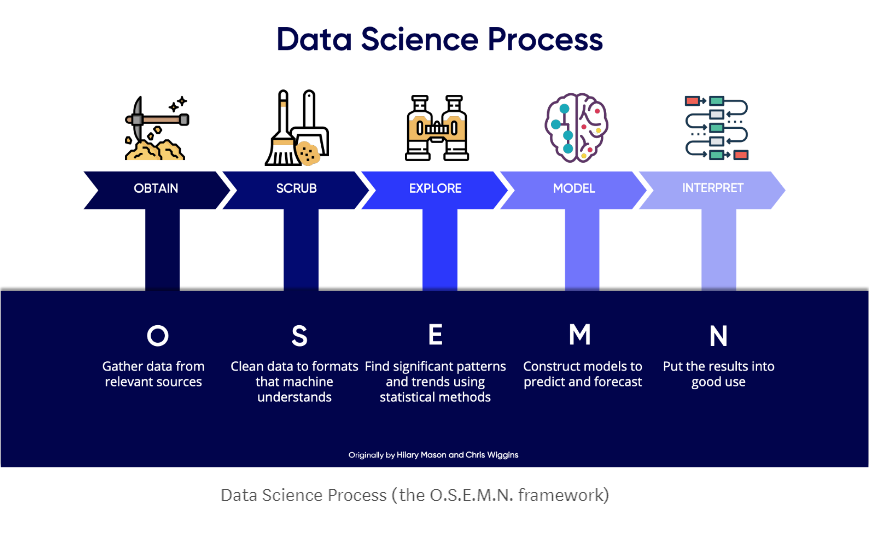

# BEST SELLING BOOKS

## Introduction

## Methodology

### 1) Obtaining the data
  * Existing Dataset: 

  * Additional Data from Goodreads API:

### 2) Scrubbing or Data Cleaning 

### 3) Exploring or EDA

### 4) Modeling 
  * Logistic Regression
  * Random Forest
  * K-Nearest Neighbor
  * Decision Tree
  * Neural Network

### 5) Result Interpretation 

## Content Files

## Presentation
- Presentation Slides: <a href="">Best Selling Books Presentation</a>

- Oral Presenation: <a href="">Best Selling Books Oral Presentation</a>

- Blog Post: <a href="">Best Selling Books</a>